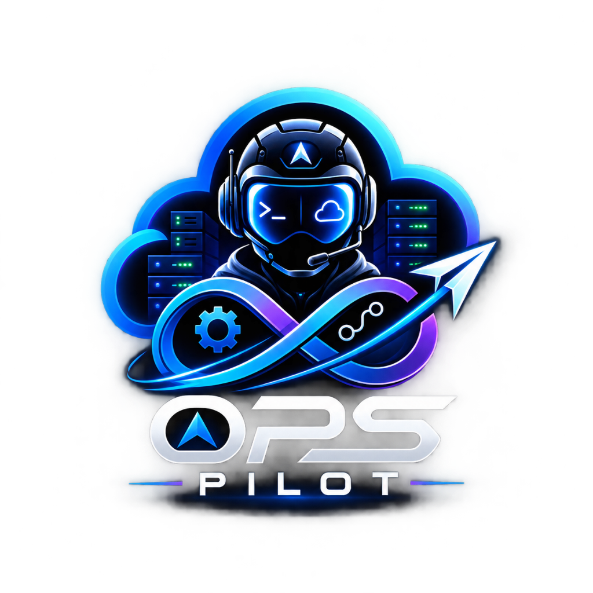
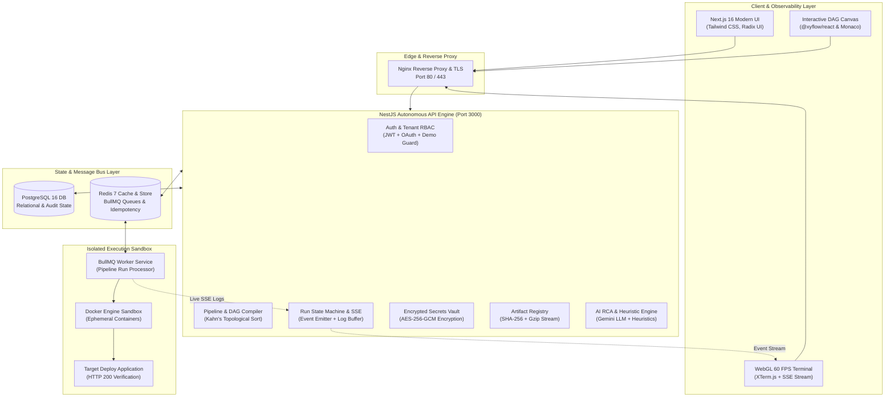

<p align="center">
  
</p>

<h1 align="center">OpsPilot AI</h1>

<p align="center">
  <strong>The Autonomous DevOps Orchestrator & Intelligent CI/CD Infrastructure Engine</strong>
</p>

<p align="center">
  <em>Next-generation CI/CD with interactive visual DAG workflows, real-time hardware-accelerated telemetry, AI-driven root cause analysis, and hermetic containerized execution.</em>
</p>

<p align="center">
  <a href="https://github.com/abdul78-create/OpsPilot"></a>
  <a href="https://nestjs.com"></a>
  <a href="https://nextjs.org"></a>
  <a href="https://postgresql.org"></a>
  <a href="https://redis.io"></a>
  <a href="https://www.docker.com"></a>
  <a href="https://opensource.org/licenses/MIT"></a>
</p>

<p align="center">
  <a href="#-quickstart-via-docker-compose"><strong>🚀 Quickstart</strong></a> •
  <a href="#-the-problem--how-opspilot-helps"><strong>💡 Why OpsPilot</strong></a> •
  <a href="#-core-capabilities"><strong>⚡ Capabilities</strong></a> •
  <a href="#-system-architecture"><strong>🏗 Architecture</strong></a> •
  <a href="#-featured-demo-projects"><strong>📦 Demo Projects</strong></a> •
  <a href="#-interactive-demo-mode-walkthrough"><strong>🎬 Demo Walkthrough</strong></a> •
  <a href="#-documentation-index"><strong>📚 Documentation</strong></a>
</p>

---

## 💡 The Problem & How OpsPilot Helps

Modern engineering teams lose **up to 40% of sprint velocity** struggling with fragmented, fragile DevOps tooling:
- **YAML Fatigue**: Thousands of lines of brittle pipeline scripts prone to subtle indentation crashes.
- **Opaque Build Failures**: Developers spend hours sifting through massive unformatted terminal logs trying to locate stack traces.
- **Host Contamination**: Builds fail unpredictably due to shared daemon dependencies or dirty state from prior runs.
- **Manual Panic Rollbacks**: Flaky releases hit production without automated canary or health-check verification.

### ✨ The OpsPilot Transformation

OpsPilot reimagines the developer operations experience as a unified, autonomous command center:

| Traditional DevOps Pain | The OpsPilot Autonomous Solution |
| :--- | :--- |
| **Complex Syntax & YAML Hell** | **Interactive Visual DAG Canvas**: Drag-and-drop node graph with Kahn's algorithm cycle detection and 2-way YAML synchronization. |
| **Hours Spent Debugging Logs** | **AI-Powered Root Cause Analysis (RCA)**: Integrated LLM engine ingests error logs, diagnoses failures, and suggests actionable fixes. |
| **Laggy, Dropped Terminal Logs** | **WebGL 60 FPS Terminal**: Hardware-accelerated XTerm.js with Server-Sent Events (SSE) streaming up to 50,000 lines seamlessly. |
| **Host System Contamination** | **Hermetic Docker Sandboxes**: Every job runs inside an isolated ephemeral container with dedicated volume scoping. |
| **Broken Production Releases** | **Automated Health-Check Rollouts**: Built-in HTTP health verification with instant automatic rollback on non-200 responses. |
| **Complex Setup & Cloud Costs** | **Instant One-Click Demo Mode**: Fully functioning multi-project environment ready in seconds without cloud credentials. |

---

## ⚡ Core Capabilities

### 🎨 Visual DAG Workflow Canvas (`@xyflow/react`)
- **No-Code / Low-Code Pipeline Design**: Build enterprise CI/CD pipelines visually using modular nodes: `Source Trigger`, `Build`, `Test`, `Security Audit`, `Approval Gate`, `Deploy`, `Health Check`, and `Rollback`.
- **Topological Sorting & Cycle Detection**: Automatically validates workflow graphs using Kahn's algorithm before execution to prevent infinite circular dependency loops.
- **Bidirectional Compilation**: Edit the visual graph or switch to Monaco Editor to edit raw YAML; changes synchronize bidirectionally in real-time.

### 🖥️ Hardware-Accelerated Telemetry (XTerm.js + SSE)
- **Zero-Latency Live Streaming**: Uses HTTP Server-Sent Events (`/v1/runs/:id/logs/stream`) to broadcast container stdout/stderr directly to browser viewports.
- **WebGL Rendering Engine**: Smooth 60 FPS rendering capable of handling high-throughput log cascades with ANSI color decoding, timestamp filtering, and multi-stage tabs.

### 🧠 Autonomous AI Diagnostics & Root Cause Analysis
- **Intelligent Error Localization**: Detects compile errors, test failures, and environment mismatches from terminal streams.
- **Confidence Scoring & Remediation**: Generates confidence-rated incident analysis reports with suggested code patches and command remedies.
- **Deterministic Fallback Engine**: Employs heuristic rule-based analyzers when external AI APIs are unconfigured, ensuring zero downtime.

### 📦 Cryptographic Artifact Registry
- **Automated Archive Packaging**: Automatically bundles build artifacts into standard gzip archives (`.tar.gz`) upon pipeline success.
- **Cryptographic Integrity**: Computes and stores SHA-256 hashes for every artifact to ensure zero tamper during deployments.
- **Direct Streaming Binary Downloads**: Stream artifacts directly to developers over HTTP `200 OK` with verified MIME types.

### 🔄 Multi-Environment Release Management
- **Staging & Production Pipelines**: Track multi-stage release rollouts across environments with detailed deployment history.
- **Simulated & Live Deployment Verification**: Continuous status transitions with verified environment health checks and rollback triggers.

### 🛡️ Enterprise Zero-Trust Security
- **AES-256-GCM Encrypted Vault**: Secrets, private keys, and API tokens are symmetrically encrypted at rest with initialization vectors and auth tags.
- **Strict Webhook HMAC Verification**: Inbound GitHub webhooks are validated using HMAC-SHA256 signatures (`X-Hub-Signature-256`) with replay attack mitigation.
- **Tenant Scoping & Secret Redaction**: Multi-tenant RBAC enforced at database queries; sensitive credentials are automatically redacted from all stdout/stderr streams.

---

## 🏗 System Architecture



---

## 📦 Featured Demo Projects

OpsPilot comes pre-configured with **3 fully functional, realistic demo projects** to provide a complete evaluation experience without needing live cloud accounts:

```text
├── 🛒 Demo E-Commerce Platform (demo-ecommerce-platform)
│   ├── Stack: Next.js 16, TypeScript, Node.js microservices
│   ├── Pipeline: Demo CI/CD Pipeline (8 stages: checkout → install → build → test → security → artifact → deploy-staging → verify)
│   └── Artifacts: Gzipped frontend & backend application bundles with verified SHA-256
│
├── 🏦 Demo Banking API (demo-banking-api)
│   ├── Stack: Go 1.22, PostgreSQL, Redis, PCI-DSS compliance checks
│   ├── Pipeline: Banking API CI/CD (lint → unit-test → SAST-scan → build-binary → deploy)
│   └── Security: Strict vault secrets masking and encrypted credentials
│
└── 🤖 Demo AI Analytics Service (demo-ai-analytics-service)
    ├── Stack: Python 3.11, PyTorch, FastAPI inference engine
    ├── Pipeline: AI Analytics CI/CD (data-validation → model-lint → pytest → docker-pack)
    └── Telemetry: Prometheus model latency and system health metrics
```

---

## 🎬 Interactive Demo Mode Walkthrough

You can test every feature of OpsPilot AI immediately in **Demo Mode**:

1. **Launch**: Navigate to `http://localhost/login` and click **"Explore Live Demo — No Setup Required"**.
2. **Explore Projects**: Browse between the 3 distinct demo projects, viewing repositories, commits, and file trees (`package.json`, `Dockerfile`, `README.md`).
3. **Trigger Pipeline Run**: Go to `/pipelines` and click **Run** on any pipeline.
4. **Watch Live Telemetry**: Watch the terminal stream real-time logs across all 8 stages with ANSI highlights:
   ```text
   [checkout-source]      Cloning git repository at commit 3e79013...
   [install-dependencies] Resolving npm lockfile (35 packages cached)...
   [build-application]    Next.js 16 static compilation completed in 4.7s...
   [test-suite]           Running 8/8 automated test suites... PASS
   [security-audit]       Vulnerability scan: 0 vulnerabilities found...
   [create-artifact]      Archiving build bundle (SHA-256: 049882ce...)...
   [deploy-staging]       Deploying container target to staging environment...
   [verify-staging]       HTTP 200 Health Probe Verified. Pipeline SUCCESS!
   ```
5. **Download Artifacts**: Navigate to `/artifacts` and click **Download** to inspect the real gzipped archive.
6. **Simulated Deployments**: Inspect release history and environment status on `/deployments` with transparent `SIMULATED` status badges.
7. **AI Workspace & Observability**: Run AI diagnostics on `/workspace` and monitor live flow topology on `/observability`.

---

## 🚀 Quickstart via Docker Compose

### Prerequisites
- [Docker Desktop](https://www.docker.com/products/docker-desktop/) (v24+ with Compose v2+)
- [Node.js](https://nodejs.org/) v20+ (optional, for local development)

### 1. Clone & Launch the Full Stack

```bash
# Clone the repository
git clone https://github.com/abdul78-create/OpsPilot.git
cd OpsPilot

# Launch all microservices in the background
docker compose up --build -d
```

### 2. Verify Container Health

```bash
docker ps --format "table {{.Names}}\t{{.Status}}\t{{.Ports}}"
```

Expected healthy output:
```text
NAMES               STATUS                   PORTS
opspilot_frontend   Up (healthy)             0.0.0.0:80->80/tcp
opspilot_backend    Up (healthy)             0.0.0.0:3000->3000/tcp
opspilot_postgres   Up (healthy)             0.0.0.0:5432->5432/tcp
opspilot_redis      Up (healthy)             0.0.0.0:6379->6379/tcp
```

### 3. Access OpsPilot Web Application

| Service | URL | Description |
| :--- | :--- | :--- |
| **OpsPilot Web UI** | `http://localhost` | Full Next.js 16 Dashboard & Demo Mode |
| **API Backend** | `http://localhost:3000/v1` | NestJS REST API Gateway |
| **Swagger OpenAPI** | `http://localhost:3000/api` | Interactive API documentation |
| **Prometheus Metrics**| `http://localhost:3000/v1/metrics/prometheus` | Real-time system telemetry |

---

## 🛠️ Technology Stack Deep Dive

```text
┌────────────────────────────────────────────────────────────────────────┐
│                          OPSPILOT TECH MATRIX                          │
├───────────────────┬────────────────────────────────────────────────────┤
│ Architecture      │ Modular Monolith with Event-Driven Worker Sandboxes │
│ Backend Engine    │ NestJS 10.x, Express, TypeScript 5.3               │
│ Frontend UI       │ Next.js 16.2 (App Router), React 19, Tailwind CSS 4 │
│ Database & ORM    │ PostgreSQL 16, Prisma ORM 5.9                      │
│ Job Queue & Cache │ Redis 7.x, BullMQ 6.x (Distributed Pipeline Queue) │
│ Pipeline DAG      │ @xyflow/react (React Flow), Monaco Code Editor     │
│ Terminal Stream   │ XTerm.js 6.x (WebGL Hardware Acceleration), SSE     │
│ Container Engine  │ Docker Engine 24+, Multi-stage Dockerfiles         │
│ Security & Vault  │ AES-256-GCM, HMAC-SHA256, Argon2, Helmet, JWT      │
│ AI Diagnostics    │ Google Gemini API + Rule-Based Heuristic Engine    │
│ Testing Suite     │ Jest 29, Supertest, Custom E2E Validation Scripts   │
└───────────────────┴────────────────────────────────────────────────────┘
```

---

## 🧪 Verification & Automated Testing

Execute the automated test suites locally:

```bash
# Run NestJS Backend Integration Tests
npm run test -- demo-mode.integration.spec.ts

# Compile Backend Production Bundle
npm run build

# Compile Frontend Production Bundle (35/35 Static Pages)
cd frontend && npm run build
```

---

## 📚 Documentation Index

Explore the comprehensive architectural and deployment documentation:

- 📖 [System Architecture Specification](docs/ARCHITECTURE.md) — Module hierarchy, relational schema, and security layers.
- 🔌 [REST API Reference](docs/API_DOCUMENTATION.md) — Comprehensive endpoint schemas, headers, and request/response payloads.
- 🚢 [Production Deployment Guide](docs/DEPLOYMENT_GUIDE.md) — Cloud VM (AWS, GCP, DigitalOcean) Docker deployment runbook.
- 💻 [Developer Contribution Guide](docs/DEVELOPER_GUIDE.md) — Local development workflow, coding standards, and lint rules.
- 🛡️ [Engineering & Security Principles](docs/ENGINEERING_PRINCIPLES.md) — Threat modeling, secret encryption, and SAIF guidelines.
- ☁️ [Render Cloud Deployment Guide](docs/RENDER_DEPLOYMENT_GUIDE.md) — Live cloud deployment guide for hosted environments.
- 📋 [Release Checklist & Evidence](docs/RELEASE_CHECKLIST.md) — Verified production milestones and runtime evidence matrix.

---

## 🏛️ Academic POC & Reality Disclosure

> **Note**: OpsPilot is developed as an advanced academic proof-of-concept demonstrating autonomous DevOps orchestration, visual DAG compilation, and AI root cause analysis.
> - **Verified Real Capabilities**: Local Docker container sandboxes, BullMQ queuing, live Server-Sent Events log streaming, PostgreSQL persistence, cryptographic SHA-256 artifact generation, and binary downloads.
> - **Simulated Demo Capabilities**: In Demo Mode, multi-cloud Kubernetes cluster provisioning and external GitHub OAuth are simulated to provide an instant, zero-cost, and reliable evaluation workflow.

---

## 📜 License

Distributed under the **MIT License**. See [`LICENSE`](LICENSE) for full details.

<p align="center">
  <sub>Built with ❤️ by the OpsPilot Engineering Team. Designed for autonomous, resilient DevOps.</sub>
</p>
